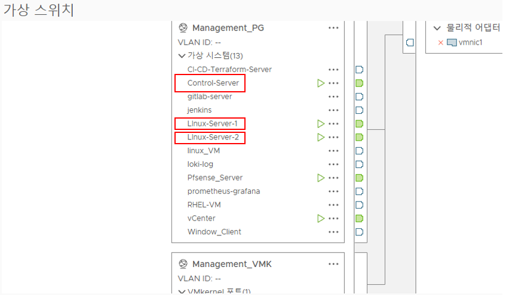
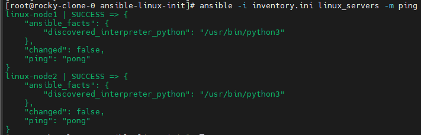
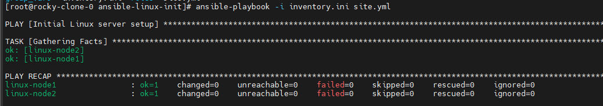
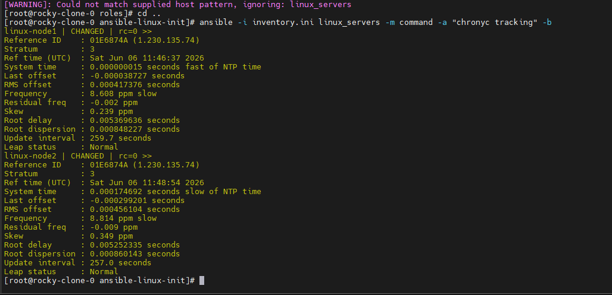

# Ansible 기반 Linux 서버 초기 세팅 자동화 프로젝트

## 1. 프로젝트 개요

본 프로젝트는 신규 Linux 서버가 배포되었을 때 반복적으로 수행해야 하는 초기 설정 작업을 Ansible Playbook으로 자동화한 미니 프로젝트입니다.

수동으로 각 서버에 접속하여 사용자 생성, sudo 권한 설정, 기본 패키지 설치, 방화벽 설정, 시간 동기화, nginx 설치 등을 수행하는 대신, Ansible Control 서버에서 여러 관리 대상 서버에 동일한 설정을 일괄 적용하도록 구성했습니다.

이를 통해 Linux 서버 운영 초기 단계에서 필요한 기본 환경을 표준화하고, 반복 작업을 줄이는 것을 목표로 했습니다.

---

## 2. 프로젝트 목표

* Ansible을 이용한 Linux 서버 초기 구성 자동화
* SSH Key 기반 원격 서버 관리 구성
* Inventory 기반 다중 서버 제어
* Playbook과 Role 구조를 활용한 설정 분리
* 사용자, sudo, SSH, 패키지, 방화벽, 서비스 설정 자동화
* 동일 Playbook을 여러 번 실행해도 안정적으로 동작하는 멱등성 확보

---

## 3. 인프라 구성

본 프로젝트는 vSphere 환경에서 Linux VM을 생성하여 구성했습니다.

```text
vSphere
├── ansible-control   # Ansible 실행 서버
├── linux-node1       # 관리 대상 서버
└── linux-node2       # 관리 대상 서버
```

### VM 구성 예시

| VM 이름           | 역할                   | OS               | 설명               |
| --------------- | -------------------- | ---------------- | ---------------- |
| ansible-control | Ansible Control Node | Rocky-9.5-x86_64-minimal | Ansible 명령 실행 서버 |
| linux-node1     | Managed Node         | Rocky-9.5-x86_64-minimal | 초기 설정 자동화 대상 서버  |
| linux-node2     | Managed Node         | Rocky-9.5-x86_64-minimal | 초기 설정 자동화 대상 서버  |

---

## 4. 사용 기술

| 기술        | 설명                                 |
| --------- | ---------------------------------- |
| Ansible   | 서버 설정 자동화 도구                       |
| SSH       | Control Node와 Managed Node 간 원격 접속 |
| YAML      | Ansible Playbook 및 변수 파일 작성        |
| Linux     | Rocky Linux / RHEL 계열 서버 환경        |
| systemd   | 서비스 enable/start 관리                |
| firewalld | Linux 방화벽 서비스 관리                   |
| chrony    | 시간 동기화 서비스                         |
| nginx     | 웹 서버 설치 및 서비스 상태 검증                |
| SELinux   | 보안 정책 상태 점검                        |

---

## 5. 네트워크 구성

각 VM은 동일 네트워크 대역에 배치했습니다.

```text
ansible-control : 172.16.1.80
linux-node1     : 172.16.1.81
linux-node2     : 172.16.1.82
```



각 서버에는 식별하기 쉬운 hostname을 설정했습니다.

```bash
sudo hostnamectl set-hostname ansible-control
sudo hostnamectl set-hostname linux-node1
sudo hostnamectl set-hostname linux-node2
```

Control 서버의 `/etc/hosts`에는 관리 대상 서버 정보를 등록했습니다.

```bash
sudo vi /etc/hosts
```

```text
172.16.1.80 ansible-control
172.16.1.81 linux-node1
172.16.1.82 linux-node2
```

---

## 6. Ansible Control 서버 구성

Ansible Control 서버에서 Ansible을 설치했습니다.

```bash
sudo dnf install -y epel-release
sudo dnf install -y ansible-core git vim
```

설치 확인:

```bash
ansible --version
```

프로젝트 디렉토리 생성:

```bash
mkdir -p ~/ansible-linux-init
cd ~/ansible-linux-init
```

---

## 7. SSH Key 기반 접속 구성

Control 서버에서 SSH Key를 생성한 뒤, 관리 대상 서버에 공개키를 복사했습니다.

```bash
ssh-keygen -t ed25519
```

```bash
ssh-copy-id ansible@linux-node1
ssh-copy-id ansible@linux-node2
```

SSH 접속 확인:

```bash
ssh ansible@linux-node1
ssh ansible@linux-node2
```

이를 통해 Ansible이 비밀번호 입력 없이 관리 대상 서버에 접속할 수 있도록 구성했습니다.

---

## 8. Inventory 구성

`inventory.ini`

```ini
[linux_servers]
linux-node1 ansible_host=172.16.1.81
linux-node2 ansible_host=172.16.1.82

[linux_servers:vars]
ansible_user=ansible
ansible_become=true
ansible_become_method=sudo
```

Inventory 연결 테스트:

```bash
ansible -i inventory.ini linux_servers -m ping
```

정상 연결 시 다음과 같이 `pong` 응답을 확인할 수 있습니다.




---

## 9. 프로젝트 디렉토리 구조

본 프로젝트는 Ansible Role 구조를 사용하여 기능별 설정을 분리했습니다.

```text
ansible-linux-init/
├── inventory.ini
├── site.yml
├── group_vars/
│   └── all.yml
├── roles/
│   ├── users/
│   │   └── tasks/
│   │       └── main.yml
│   ├── sudoers/
│   │   └── tasks/
│   │       └── main.yml
│   ├── packages/
│   │   └── tasks/
│   │       └── main.yml
│   ├── chrony/
│   │   └── tasks/
│   │       └── main.yml
│   ├── firewalld/
│   │   └── tasks/
│   │       └── main.yml
│   ├── nginx/
│   │   └── tasks/
│   │       └── main.yml
│   ├── ssh/
│   │   ├── tasks/
│   │   │   └── main.yml
│   │   └── handlers/
│   │       └── main.yml
│   └── selinux/
│       └── tasks/
│           └── main.yml
└── README.md
```

---

## 10. 자동화 항목

| 항목           | 설명                                            |
| ------------ | --------------------------------------------- |
| 사용자 생성       | `devops` 사용자 생성 및 wheel 그룹 추가                 |
| sudoers 설정   | wheel 그룹 sudo 권한 설정                           |
| 기본 패키지 설치    | vim, git, wget, curl, net-tools 등 기본 운영 도구 설치 |
| chrony 설정    | 시간 동기화 서비스 설치 및 활성화                           |
| firewalld 설정 | 방화벽 서비스 활성화 및 ssh/http 허용                     |
| nginx 설치     | nginx 설치 및 systemd 서비스 활성화                    |
| SSH 보안 설정    | root SSH 로그인 차단                               |
| SELinux 점검   | SELinux 상태 확인                                 |

---

## 11. 변수 파일 구성

`group_vars/all.yml`

```yaml
---
admin_users:
  - name: devops
    groups: wheel
    shell: /bin/bash

base_packages:
  - vim
  - git
  - wget
  - curl
  - net-tools
  - bind-utils
  - bash-completion
  - chrony
  - firewalld
  - nginx
  - audit

ssh_port: 22
permit_root_login: "no"
password_authentication: "yes"
```

SSH Key 기반 접속이 완전히 안정화되기 전까지는 `PasswordAuthentication`을 `yes`로 유지했습니다.
이후 운영 환경에서는 SSH Key 접속을 검증한 뒤 `no`로 변경할 수 있습니다.

---

## 12. 메인 Playbook

`site.yml`

```yaml
---
- name: Initial Linux server setup
  hosts: linux_servers
  become: true

  roles:
    - users
    - sudoers
    - packages
    - chrony
    - firewalld
    - nginx
    - ssh
    - selinux
```

실행 명령:

```bash
ansible-playbook -i inventory.ini site.yml
```



---

## 13. Role별 주요 구성

### 13.1 users Role

관리 대상 서버에 관리자용 사용자를 생성하고 wheel 그룹에 추가합니다.

`roles/users/tasks/main.yml`

```yaml
---
- name: Create admin users
  ansible.builtin.user:
    name: "{{ item.name }}"
    groups: "{{ item.groups }}"
    append: true
    shell: "{{ item.shell }}"
    state: present
  loop: "{{ admin_users }}"
```

---

### 13.2 sudoers Role

wheel 그룹에 sudo 권한을 부여합니다.

`roles/sudoers/tasks/main.yml`

```yaml
---
- name: Allow wheel group to use sudo
  ansible.builtin.lineinfile:
    path: /etc/sudoers
    regexp: '^%wheel'
    line: '%wheel ALL=(ALL) ALL'
    validate: '/usr/sbin/visudo -cf %s'
```

`validate` 옵션을 사용하여 sudoers 파일 수정 전 문법 검사를 수행하도록 구성했습니다.
이를 통해 잘못된 sudoers 설정으로 인해 sudo 사용이 불가능해지는 문제를 방지했습니다.

---

### 13.3 packages Role

운영에 필요한 기본 패키지를 설치합니다.

`roles/packages/tasks/main.yml`

```yaml
---
- name: Install base packages
  ansible.builtin.dnf:
    name: "{{ base_packages }}"
    state: present
```

---

### 13.4 chrony Role

시간 동기화를 위해 chrony를 설치하고 서비스를 활성화합니다.

`roles/chrony/tasks/main.yml`

```yaml
---
- name: Install chrony
  ansible.builtin.dnf:
    name: chrony
    state: present

- name: Enable and start chronyd
  ansible.builtin.systemd:
    name: chronyd
    enabled: true
    state: started
```

검증 명령:

```bash
ansible -i inventory.ini linux_servers -m command -a "chronyc tracking" -b
```




---

### 13.5 firewalld Role

방화벽 서비스를 활성화하고 SSH, HTTP 서비스를 허용합니다.

`roles/firewalld/tasks/main.yml`

```yaml
---
- name: Install firewalld
  ansible.builtin.dnf:
    name: firewalld
    state: present

- name: Enable and start firewalld
  ansible.builtin.systemd:
    name: firewalld
    enabled: true
    state: started

- name: Allow SSH service
  ansible.posix.firewalld:
    service: ssh
    permanent: true
    immediate: true
    state: enabled

- name: Allow HTTP service
  ansible.posix.firewalld:
    service: http
    permanent: true
    immediate: true
    state: enabled
```

필요한 collection 설치:

```bash
ansible-galaxy collection install ansible.posix
```

검증 명령:

```bash
ansible -i inventory.ini linux_servers -m command -a "firewall-cmd --list-services" -b
```

---

### 13.6 nginx Role

nginx를 설치하고 systemd를 통해 자동 시작되도록 구성합니다.

`roles/nginx/tasks/main.yml`

```yaml
---
- name: Install nginx
  ansible.builtin.dnf:
    name: nginx
    state: present

- name: Enable and start nginx
  ansible.builtin.systemd:
    name: nginx
    enabled: true
    state: started
```

검증 명령:

```bash
ansible -i inventory.ini linux_servers -m command -a "systemctl is-active nginx" -b
ansible -i inventory.ini linux_servers -m command -a "systemctl is-enabled nginx" -b
```

브라우저 또는 curl로 nginx 기본 페이지 접속을 확인할 수 있습니다.

```bash
curl http://172.16.1.81
curl http://172.16.1.82
```

---

### 13.7 SSH Role

SSH 설정에서 root 계정의 직접 로그인을 차단합니다.

`roles/ssh/tasks/main.yml`

```yaml
---
- name: Disable root SSH login
  ansible.builtin.lineinfile:
    path: /etc/ssh/sshd_config
    regexp: '^#?PermitRootLogin'
    line: "PermitRootLogin {{ permit_root_login }}"
    backup: true
  notify: Restart sshd

- name: Configure SSH password authentication
  ansible.builtin.lineinfile:
    path: /etc/ssh/sshd_config
    regexp: '^#?PasswordAuthentication'
    line: "PasswordAuthentication {{ password_authentication }}"
    backup: true
  notify: Restart sshd
```

`roles/ssh/handlers/main.yml`

```yaml
---
- name: Restart sshd
  ansible.builtin.systemd:
    name: sshd
    state: restarted
```

SSH 설정 파일 변경 시 handler를 통해 sshd 서비스를 재시작하도록 구성했습니다.

---

### 13.8 SELinux Role

SELinux는 보안상 중요한 기능이므로 비활성화하지 않고 현재 상태를 점검하는 방식으로 구성했습니다.

`roles/selinux/tasks/main.yml`

```yaml
---
- name: Check SELinux status
  ansible.builtin.command: getenforce
  register: selinux_status
  changed_when: false

- name: Print SELinux status
  ansible.builtin.debug:
    msg: "SELinux status is {{ selinux_status.stdout }}"
```

검증 명령:

```bash
ansible -i inventory.ini linux_servers -m command -a "getenforce" -b
```

---

## 14. 실행 방법

### 1단계. Inventory 연결 확인

```bash
ansible -i inventory.ini linux_servers -m ping
```

### 2단계. Playbook 실행

```bash
ansible-playbook -i inventory.ini site.yml
```

### 3단계. 적용 결과 확인

```bash
ansible -i inventory.ini linux_servers -m command -a "id devops" -b
ansible -i inventory.ini linux_servers -m command -a "systemctl is-active nginx" -b
ansible -i inventory.ini linux_servers -m command -a "systemctl is-enabled nginx" -b
ansible -i inventory.ini linux_servers -m command -a "firewall-cmd --list-services" -b
ansible -i inventory.ini linux_servers -m command -a "getenforce" -b
```

---

## 15. 검증 결과

Playbook 실행 후 다음 항목을 확인했습니다.

| 검증 항목       | 확인 방법                          | 기대 결과                      |
| ----------- | ------------------------------ | -------------------------- |
| Ansible 연결  | `ansible -m ping`              | pong 응답                    |
| 사용자 생성      | `id devops`                    | devops 사용자 확인              |
| sudo 권한     | wheel 그룹 확인                    | devops 사용자가 wheel 그룹에 포함   |
| nginx 상태    | `systemctl is-active nginx`    | active                     |
| nginx 자동 시작 | `systemctl is-enabled nginx`   | enabled                    |
| 방화벽 허용 서비스  | `firewall-cmd --list-services` | ssh, http 포함               |
| chrony 상태   | `chronyc tracking`             | 시간 동기화 상태 출력               |
| SELinux 상태  | `getenforce`                   | Enforcing 또는 Permissive 출력 |

---

## 16. 프로젝트에서 학습한 내용

### 16.1 Ansible Inventory 기반 서버 관리

관리 대상 서버의 IP, 접속 사용자, become 설정을 Inventory에 정의하여 여러 서버를 일괄 관리하는 방법을 학습했습니다.

### 16.2 Playbook과 Role 분리

하나의 긴 Playbook에 모든 작업을 작성하지 않고, users, sudoers, packages, chrony, firewalld, nginx, ssh, selinux 역할로 분리했습니다.
이를 통해 설정 파일의 가독성과 유지보수성을 높였습니다.

### 16.3 멱등성

Ansible의 주요 특징인 멱등성을 확인했습니다.
동일한 Playbook을 여러 번 실행해도 이미 원하는 상태라면 중복 변경이 발생하지 않고, 시스템 상태가 안정적으로 유지됩니다.

### 16.4 systemd 서비스 관리

nginx, chronyd, firewalld와 같은 서비스를 Ansible의 systemd 모듈로 관리했습니다.
서비스를 단순히 실행하는 것뿐 아니라 재부팅 후에도 자동 시작되도록 `enabled: true` 설정을 적용했습니다.

### 16.5 sudoers 설정 안정성

sudoers 파일은 잘못 수정하면 sudo 사용이 불가능해질 수 있기 때문에 `visudo -cf` 검증을 추가했습니다.
이를 통해 설정 자동화 과정에서도 안전성을 확보했습니다.

### 16.6 SELinux 보안 접근

SELinux를 단순히 비활성화하지 않고 현재 상태를 점검하는 방식으로 구성했습니다.
보안 기능을 무조건 끄는 방식이 아니라, 운영 환경에서 현재 보안 상태를 확인하는 방향으로 접근했습니다.

---

## 17. 트러블슈팅

### 17.1 SSH 접속 권한 문제

Ansible Control 서버에서 관리 대상 서버로 접속하기 위해 SSH Key 기반 인증을 구성했습니다.

```bash
ssh-copy-id ansible@linux-node1
ssh-copy-id ansible@linux-node2
```

이후 다음 명령으로 접속 여부를 확인했습니다.

```bash
ansible -i inventory.ini linux_servers -m ping
```

---

### 17.2 sudo 권한 문제

관리 대상 서버에서 Ansible 작업을 root 권한으로 실행해야 하므로 `ansible_become=true`를 설정했습니다.

```ini
[linux_servers:vars]
ansible_user=ansible
ansible_become=true
ansible_become_method=sudo
```

```bash
%ansible ALL=(ALL) NOPASSWD: ALL
```

또한 관리 대상 서버의 ansible 사용자가 sudo 권한을 패스워드 사용없이 사용할 수 있도록 visudo에  내용을 추가하여 구성했습니다.

---

### 17.3 firewalld 모듈 사용 문제

`ansible.posix.firewalld` 모듈을 사용하기 위해 필요한 collection을 설치했습니다.

```bash
ansible-galaxy collection install ansible.posix
```

---

## 18. 향후 개선 방향

현재 프로젝트는 1차 버전으로 Linux 서버 초기 설정 자동화에 집중했습니다.
향후에는 다음 기능을 추가하여 프로젝트를 확장할 수 있습니다.

### 2차 버전 개선 방향

* auditd rule 배포
* 로그 디렉토리 생성 및 권한 설정
* cron 작업 등록
* systemd timer 등록
* NFS/autofs 설정 자동화

### 3차 버전 개선 방향

* vSphere Template 연동
* Terraform을 이용한 VM 생성 자동화
* Ansible Vault를 이용한 민감정보 관리
* ansible-lint를 이용한 Playbook 정적 검사
* GitHub Actions를 이용한 Playbook 문법 검사 자동화

---

## 19. 프로젝트 의의

이 프로젝트는 단순히 Linux 명령어를 수동으로 실행하는 수준을 넘어, 서버 초기 설정 작업을 Ansible로 표준화하고 자동화했다는 점에 의미가 있습니다.

특히 RHCSA/Linux 학습에서 다루는 사용자 관리, sudo 권한, 패키지 설치, systemd 서비스 관리, 방화벽, SELinux, SSH 설정 등을 실제 서버 자동화 흐름으로 연결했습니다.

이를 통해 Linux 서버 운영 환경에서 반복적인 초기 설정 작업을 자동화하고, 여러 서버에 일관된 설정을 적용하는 기본적인 Infrastructure Automation 역량을 학습할 수 있었습니다.

---

